## basic

 - 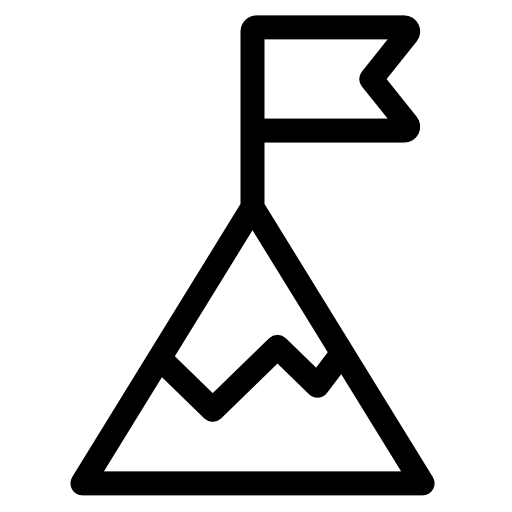 - `<Icon group="basic" name="achievement" />`
 - 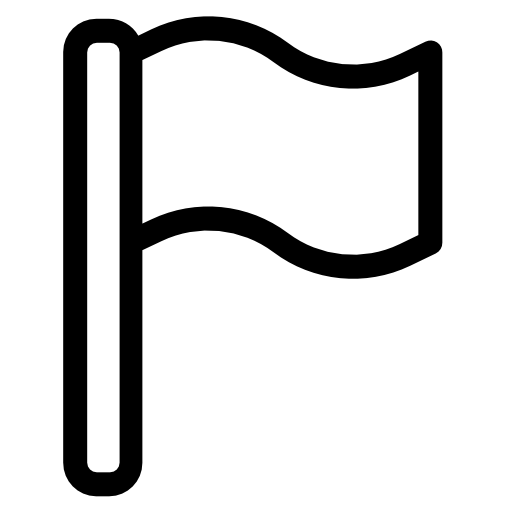 - `<Icon group="basic" name="flag" />`
 - 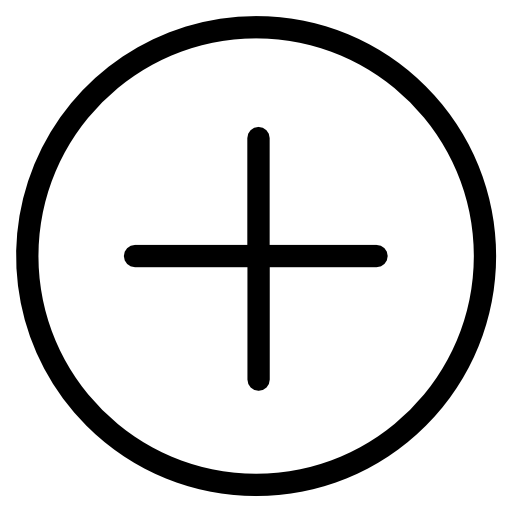 - `<Icon group="basic" name="add" />`
 - 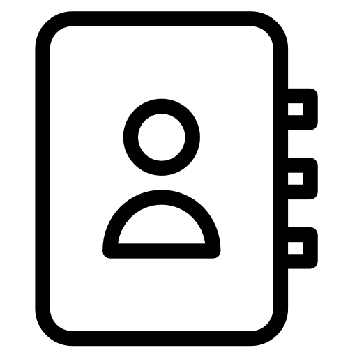 - `<Icon group="basic" name="contacs" />`
 - 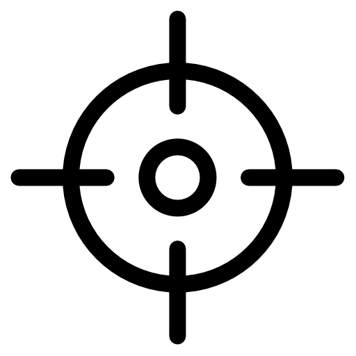 - `<Icon group="basic" name="aim" />`
 - 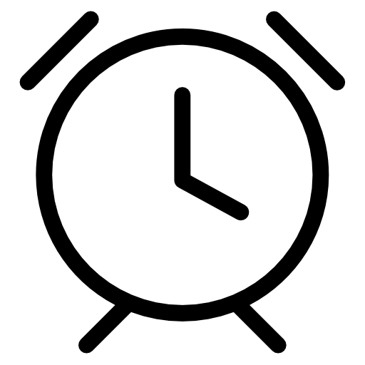 - `<Icon group="basic" name="clock" />`
 - 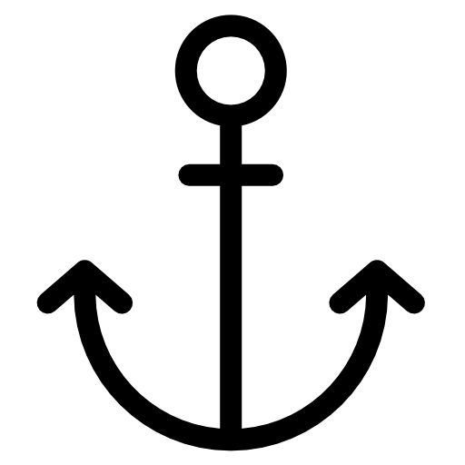 - `<Icon group="basic" name="anchor" />`
 -  - `<Icon group="basic" name="tick" />`
 -  - `<Icon group="basic" name="archive" />`
 -  - `<Icon group="basic" name="atm-card" />`
 - 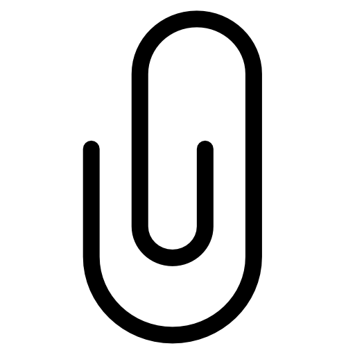 - `<Icon group="basic" name="attach" />`
 - 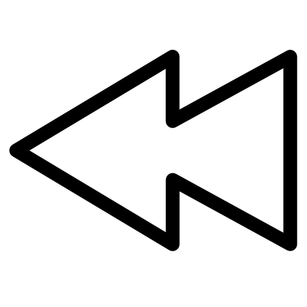 - `<Icon group="basic" name="backwards" />`
 -  - `<Icon group="basic" name="badge" />`
 -  - `<Icon group="basic" name="bag" />`
 - 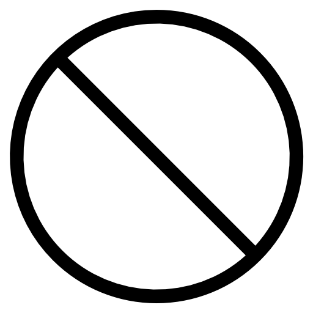 - `<Icon group="basic" name="ban" />`
 - 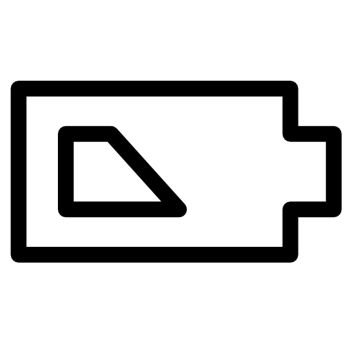 - `<Icon group="basic" name="low-battery" />`
 - 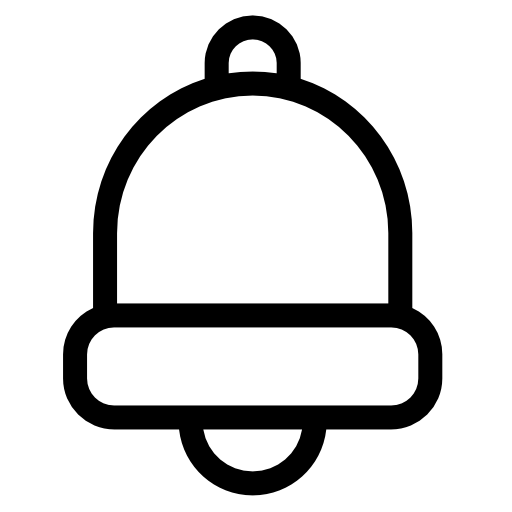 - `<Icon group="basic" name="bell" />`
 - 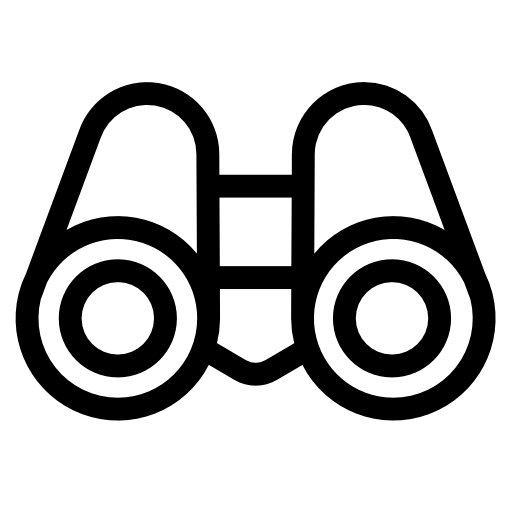 - `<Icon group="basic" name="binocular" />`
 - 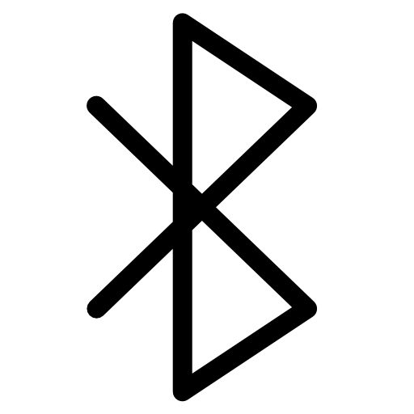 - `<Icon group="basic" name="bluetooth" />`
 -  - `<Icon group="basic" name="board" />`
 - 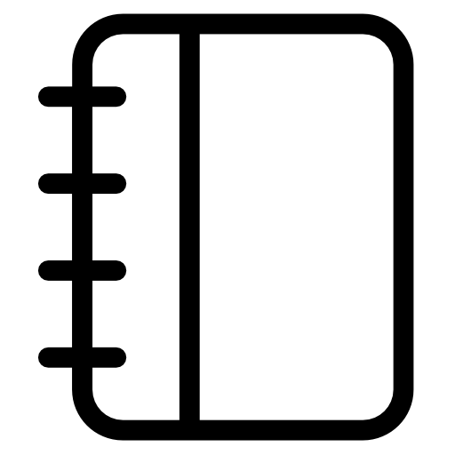 - `<Icon group="basic" name="notebook" />`
 - 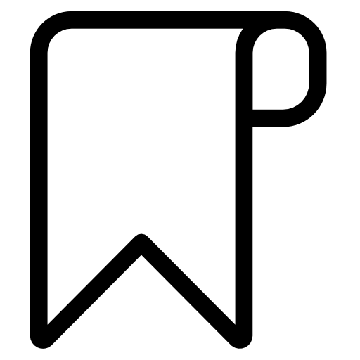 - `<Icon group="basic" name="bookmark" />`
 -  - `<Icon group="basic" name="book" />`
 - 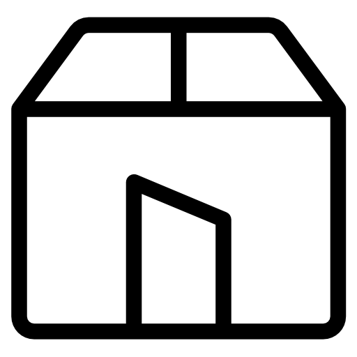 - `<Icon group="basic" name="box" />`
 -  - `<Icon group="basic" name="briefcase" />`
 - 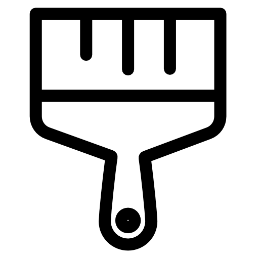 - `<Icon group="basic" name="brush" />`
 - 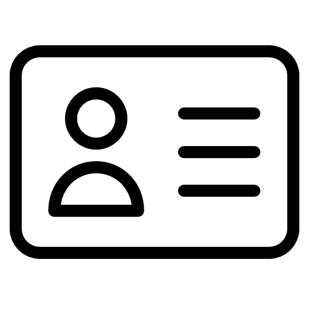 - `<Icon group="basic" name="identification" />`
 - 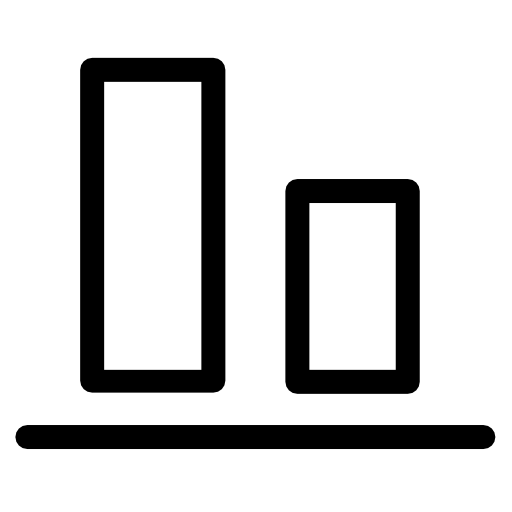 - `<Icon group="basic" name="bar" />`
 -  - `<Icon group="basic" name="calendar" />`
 -  - `<Icon group="basic" name="telephone" />`
 - 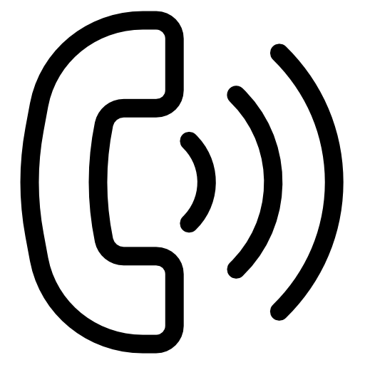 - `<Icon group="basic" name="call" />`
 -  - `<Icon group="basic" name="cancel" />`
 -  - `<Icon group="basic" name="cart" />`
 - 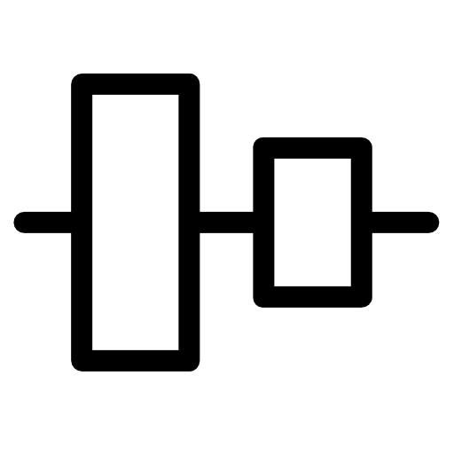 - `<Icon group="basic" name="center-align" />`
 - 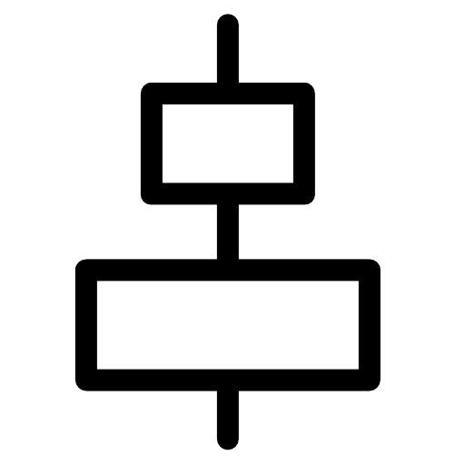 - `<Icon group="basic" name="center-align-1" />`
 - 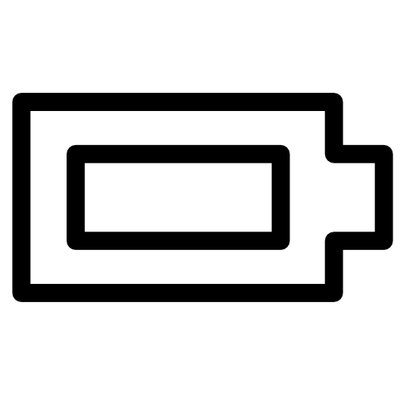 - `<Icon group="basic" name="full-battery" />`
 -  - `<Icon group="basic" name="tick-1" />`
 -  - `<Icon group="basic" name="writing" />`
 -  - `<Icon group="basic" name="writing-1" />`
 - 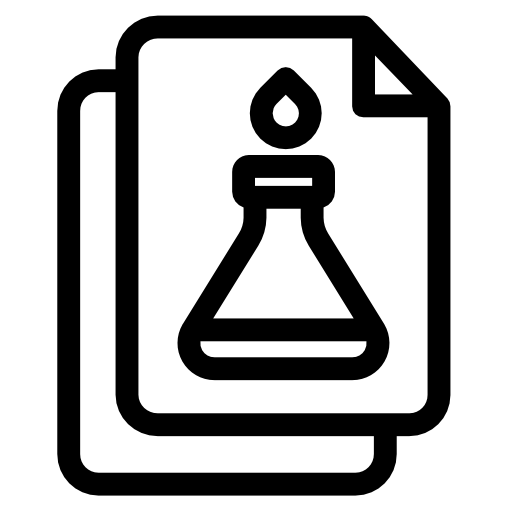 - `<Icon group="basic" name="chemistry" />`
 -  - `<Icon group="basic" name="chemistry-1" />`
 -  - `<Icon group="basic" name="tubes" />`
 - 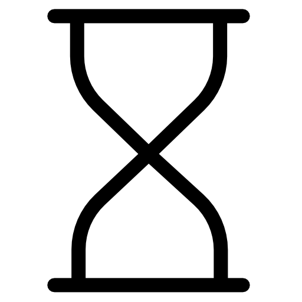 - `<Icon group="basic" name="sand-clock" />`
 -  - `<Icon group="basic" name="code" />`
 -  - `<Icon group="basic" name="code-1" />`
 -  - `<Icon group="basic" name="gear" />`
 - 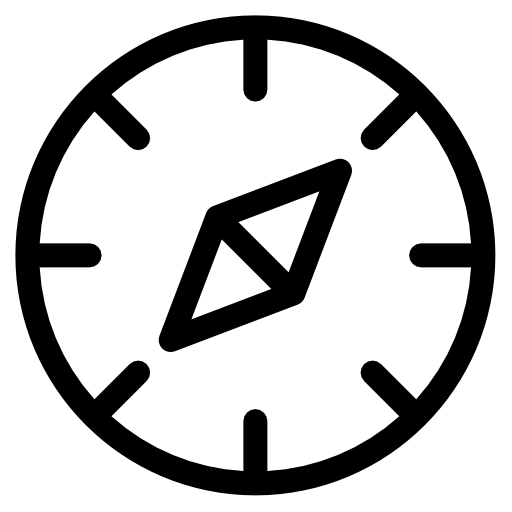 - `<Icon group="basic" name="compass" />`
 - 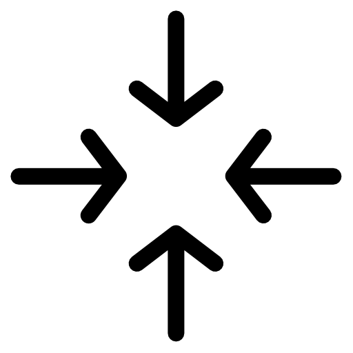 - `<Icon group="basic" name="compress" />`
 -  - `<Icon group="basic" name="monitor" />`
 - 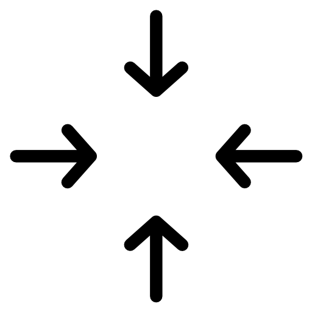 - `<Icon group="basic" name="compress-1" />`
 -  - `<Icon group="basic" name="contact-book" />`
 - 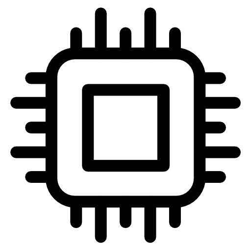 - `<Icon group="basic" name="cpu" />`
 - 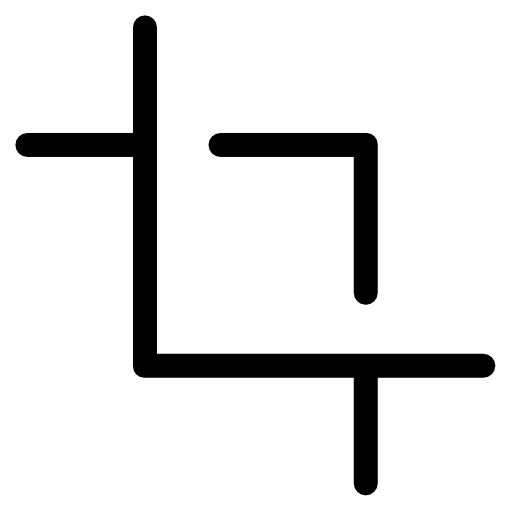 - `<Icon group="basic" name="crop" />`
 -  - `<Icon group="basic" name="headphones" />`
 - 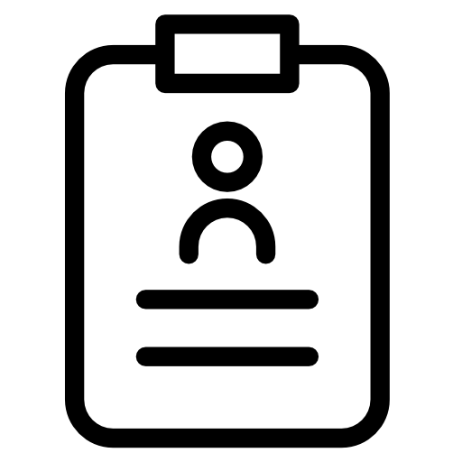 - `<Icon group="basic" name="curriculum" />`
 - 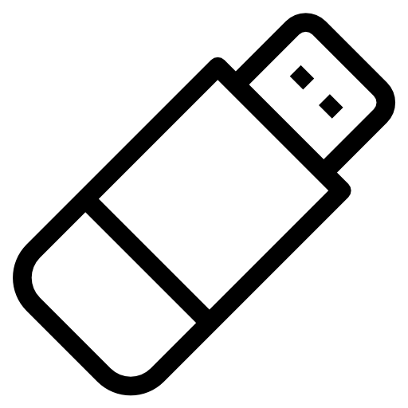 - `<Icon group="basic" name="pendrive" />`
 -  - `<Icon group="basic" name="calendar-1" />`
 -  - `<Icon group="basic" name="calendar-2" />`
 - 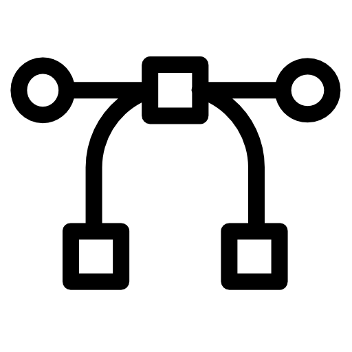 - `<Icon group="basic" name="anchor-point" />`
 - 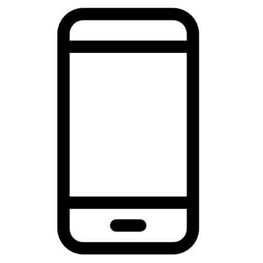 - `<Icon group="basic" name="smartphone" />`
 - 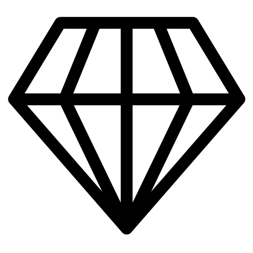 - `<Icon group="basic" name="diamond" />`
 -  - `<Icon group="basic" name="diary" />`
 -  - `<Icon group="basic" name="syringe" />`
 - 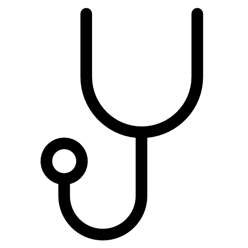 - `<Icon group="basic" name="stethoscope" />`
 -  - `<Icon group="basic" name="approved" />`
 -  - `<Icon group="basic" name="archives" />`
 - 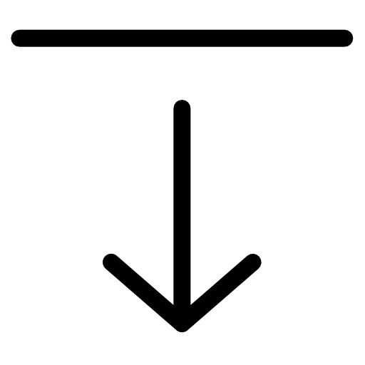 - `<Icon group="basic" name="down-arrow" />`
 - 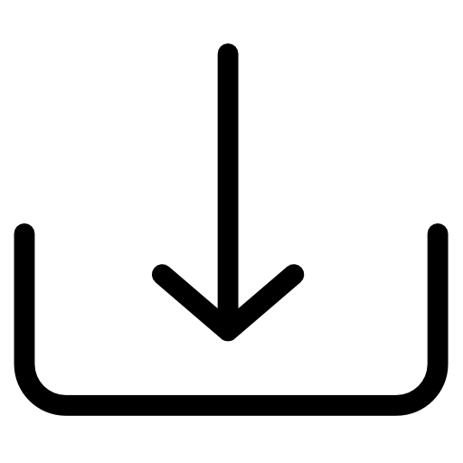 - `<Icon group="basic" name="down-arrow-1" />`
 -  - `<Icon group="basic" name="drink" />`
 -  - `<Icon group="basic" name="writing-2" />`
 -  - `<Icon group="basic" name="writing-3" />`
 -  - `<Icon group="basic" name="writing-4" />`
 -  - `<Icon group="basic" name="edit" />`
 -  - `<Icon group="basic" name="pen" />`
 -  - `<Icon group="basic" name="pen-1" />`
 -  - `<Icon group="basic" name="calendar-3" />`
 -  - `<Icon group="basic" name="calendar-4" />`
 -  - `<Icon group="basic" name="calendar-5" />`
 -  - `<Icon group="basic" name="calendar-6" />`
 -  - `<Icon group="basic" name="event" />`
 -  - `<Icon group="basic" name="event-1" />`
 -  - `<Icon group="basic" name="tube" />`
 - 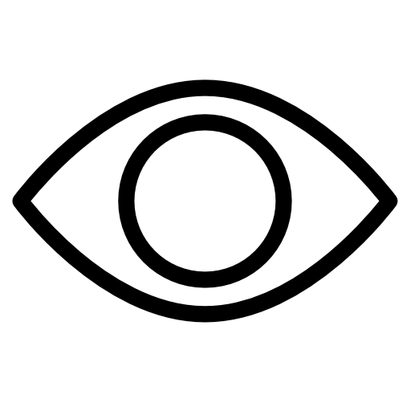 - `<Icon group="basic" name="eye" />`
 - 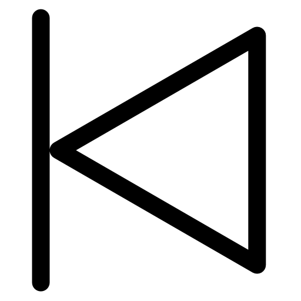 - `<Icon group="basic" name="backward" />`
 - 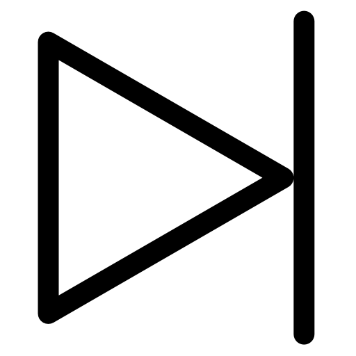 - `<Icon group="basic" name="forward" />`
 -  - `<Icon group="basic" name="paper" />`
 - 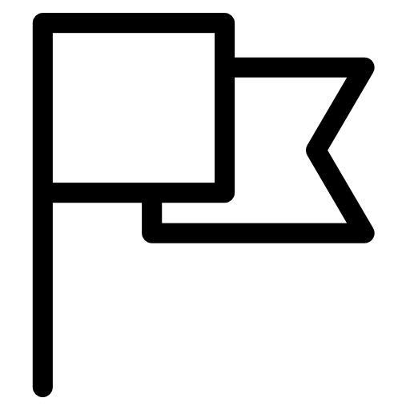 - `<Icon group="basic" name="flag-1" />`
 - 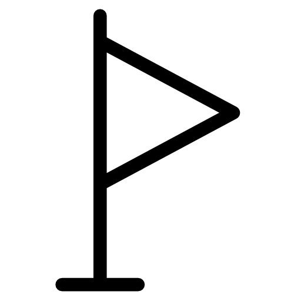 - `<Icon group="basic" name="flag-2" />`
 -  - `<Icon group="basic" name="thunder" />`
 -  - `<Icon group="basic" name="flask" />`
 -  - `<Icon group="basic" name="flask-1" />`
 - 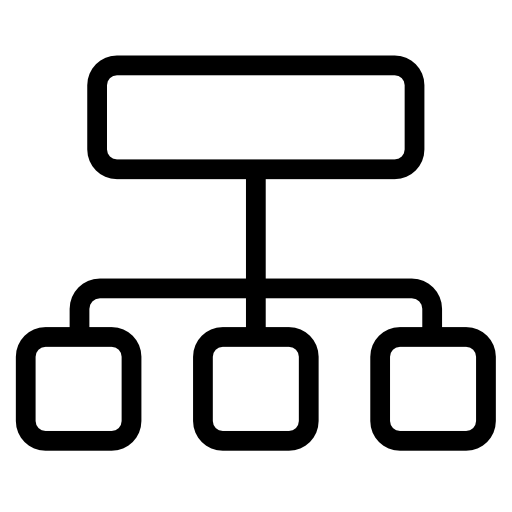 - `<Icon group="basic" name="diagram" />`
 -  - `<Icon group="basic" name="folder" />`
 - 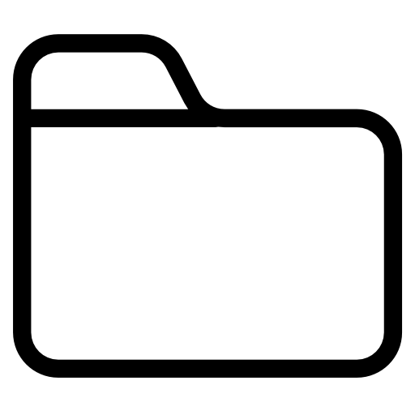 - `<Icon group="basic" name="folder-1" />`
 - 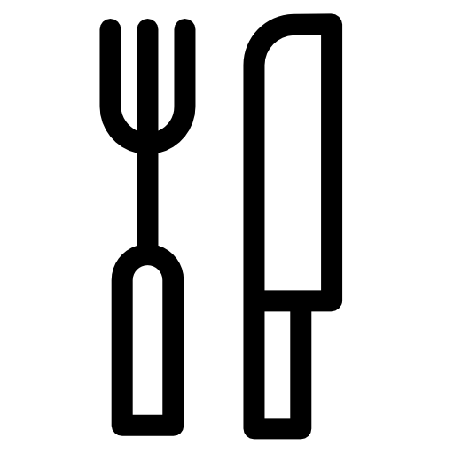 - `<Icon group="basic" name="cutlery" />`
 -  - `<Icon group="basic" name="forward-1" />`
 - 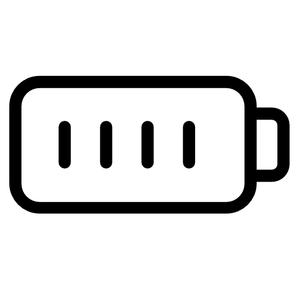 - `<Icon group="basic" name="full-battery-1" />`
 -  - `<Icon group="basic" name="present" />`
 -  - `<Icon group="basic" name="present-1" />`
 - 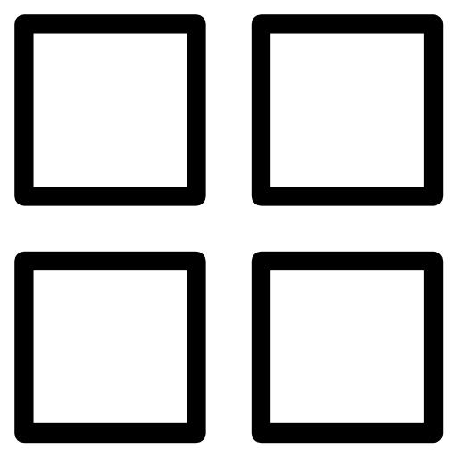 - `<Icon group="basic" name="squares" />`
 - 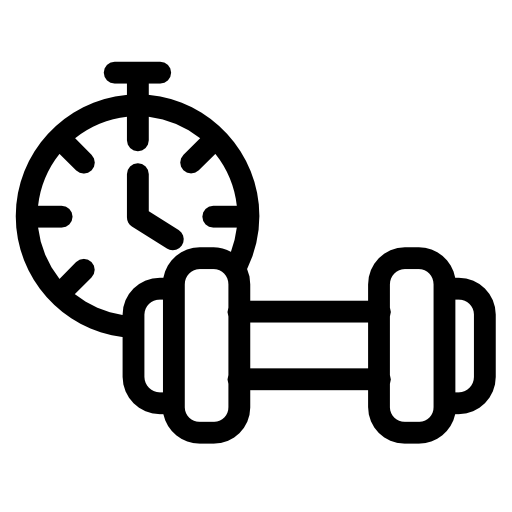 - `<Icon group="basic" name="gym" />`
 -  - `<Icon group="basic" name="headphones-1" />`
 -  - `<Icon group="basic" name="blind" />`
 -  - `<Icon group="basic" name="identification-1" />`
 -  - `<Icon group="basic" name="name" />`
 -  - `<Icon group="basic" name="postal" />`
 -  - `<Icon group="basic" name="image" />`
 -  - `<Icon group="basic" name="image-1" />`
 -  - `<Icon group="basic" name="in" />`
 -  - `<Icon group="basic" name="inbox" />`
 -  - `<Icon group="basic" name="router" />`
 -  - `<Icon group="basic" name="layers" />`
 -  - `<Icon group="basic" name="left-alignment" />`
 -  - `<Icon group="basic" name="left-arrow" />`
 -  - `<Icon group="basic" name="lamp" />`
 -  - `<Icon group="basic" name="placeholder" />`
 -  - `<Icon group="basic" name="placeholder-1" />`
 -  - `<Icon group="basic" name="in-1" />`
 -  - `<Icon group="basic" name="out" />`
 -  - `<Icon group="basic" name="wand" />`
 -  - `<Icon group="basic" name="magnet" />`
 -  - `<Icon group="basic" name="letter" />`
 -  - `<Icon group="basic" name="measurement" />`
 -  - `<Icon group="basic" name="menu" />`
 -  - `<Icon group="basic" name="message" />`
 -  - `<Icon group="basic" name="microphone" />`
 -  - `<Icon group="basic" name="minimize" />`
 -  - `<Icon group="basic" name="mobile" />`
 -  - `<Icon group="basic" name="monitor-1" />`
 -  - `<Icon group="basic" name="more" />`
 -  - `<Icon group="basic" name="note" />`
 -  - `<Icon group="basic" name="notepad" />`
 -  - `<Icon group="basic" name="note-1" />`
 -  - `<Icon group="basic" name="slider" />`
 -  - `<Icon group="basic" name="slider-1" />`
 -  - `<Icon group="basic" name="organization" />`
 -  - `<Icon group="basic" name="log-out" />`
 -  - `<Icon group="basic" name="package" />`
 -  - `<Icon group="basic" name="page" />`
 -  - `<Icon group="basic" name="pages" />`
 -  - `<Icon group="basic" name="pause" />`
 -  - `<Icon group="basic" name="writing-5" />`
 -  - `<Icon group="basic" name="physics" />`
 -  - `<Icon group="basic" name="pin" />`
 -  - `<Icon group="basic" name="placeholder-2" />`
 -  - `<Icon group="basic" name="play" />`
 -  - `<Icon group="basic" name="presentation" />`
 -  - `<Icon group="basic" name="profile" />`
 -  - `<Icon group="basic" name="profile-1" />`
 -  - `<Icon group="basic" name="book-1" />`
 -  - `<Icon group="basic" name="recycle" />`
 -  - `<Icon group="basic" name="recycle-1" />`
 -  - `<Icon group="basic" name="recycle-2" />`
 -  - `<Icon group="basic" name="refresh" />`
 -  - `<Icon group="basic" name="resume" />`
 -  - `<Icon group="basic" name="ribbon" />`
 -  - `<Icon group="basic" name="right-alignment" />`
 -  - `<Icon group="basic" name="right" />`
 -  - `<Icon group="basic" name="roller" />`
 -  - `<Icon group="basic" name="router-1" />`
 -  - `<Icon group="basic" name="ruler" />`
 -  - `<Icon group="basic" name="sand-clock-1" />`
 -  - `<Icon group="basic" name="monitor-2" />`
 -  - `<Icon group="basic" name="search" />`
 -  - `<Icon group="basic" name="rulers" />`
 -  - `<Icon group="basic" name="set-square" />`
 -  - `<Icon group="basic" name="gear-1" />`
 -  - `<Icon group="basic" name="share" />`
 -  - `<Icon group="basic" name="shield" />`
 -  - `<Icon group="basic" name="shopping-bag" />`
 -  - `<Icon group="basic" name="shopping-cart" />`
 -  - `<Icon group="basic" name="shopping-cart-1" />`
 -  - `<Icon group="basic" name="wristwatch" />`
 -  - `<Icon group="basic" name="star" />`
 -  - `<Icon group="basic" name="street-light" />`
 -  - `<Icon group="basic" name="syringe-1" />`
 -  - `<Icon group="basic" name="tablet" />`
 -  - `<Icon group="basic" name="tag" />`
 -  - `<Icon group="basic" name="test-tube" />`
 -  - `<Icon group="basic" name="document" />`
 -  - `<Icon group="basic" name="ticket" />`
 -  - `<Icon group="basic" name="tie" />`
 -  - `<Icon group="basic" name="chronometer" />`
 -  - `<Icon group="basic" name="sand-clock-2" />`
 -  - `<Icon group="basic" name="tissue-roll" />`
 -  - `<Icon group="basic" name="top-alignment" />`
 -  - `<Icon group="basic" name="torch" />`
 -  - `<Icon group="basic" name="recycle-3" />`
 -  - `<Icon group="basic" name="recycle-4" />`
 -  - `<Icon group="basic" name="trash" />`
 -  - `<Icon group="basic" name="trolley" />`
 -  - `<Icon group="basic" name="up-arrow" />`
 -  - `<Icon group="basic" name="upload" />`
 -  - `<Icon group="basic" name="upload-1" />`
 -  - `<Icon group="basic" name="upload-2" />`
 -  - `<Icon group="basic" name="usb-cable" />`
 -  - `<Icon group="basic" name="usb" />`
 -  - `<Icon group="basic" name="add-user" />`
 -  - `<Icon group="basic" name="user" />`
 -  - `<Icon group="basic" name="user-1" />`
 -  - `<Icon group="basic" name="user-2" />`
 -  - `<Icon group="basic" name="delete-user" />`
 -  - `<Icon group="basic" name="user-3" />`
 -  - `<Icon group="basic" name="user-4" />`
 -  - `<Icon group="basic" name="user-5" />`
 -  - `<Icon group="basic" name="user-6" />`
 -  - `<Icon group="basic" name="user-7" />`
 -  - `<Icon group="basic" name="user-8" />`
 -  - `<Icon group="basic" name="user-9" />`
 -  - `<Icon group="basic" name="contact-information" />`
 -  - `<Icon group="basic" name="user-10" />`
 -  - `<Icon group="basic" name="user-11" />`
 -  - `<Icon group="basic" name="user-12" />`
 -  - `<Icon group="basic" name="block-user" />`
 -  - `<Icon group="basic" name="user-13" />`
 -  - `<Icon group="basic" name="user-14" />`
 -  - `<Icon group="basic" name="user-15" />`
 -  - `<Icon group="basic" name="user-16" />`
 -  - `<Icon group="basic" name="user-17" />`
 -  - `<Icon group="basic" name="users" />`
 -  - `<Icon group="basic" name="vector" />`
 -  - `<Icon group="basic" name="verified" />`
 -  - `<Icon group="basic" name="video-camera" />`
 -  - `<Icon group="basic" name="video" />`
 -  - `<Icon group="basic" name="eye-1" />`
 -  - `<Icon group="basic" name="mute" />`
 -  - `<Icon group="basic" name="mute-1" />`
 -  - `<Icon group="basic" name="low-volume" />`
 -  - `<Icon group="basic" name="wall-clock" />`
 -  - `<Icon group="basic" name="wristwatch-1" />`
 -  - `<Icon group="basic" name="drop" />`
 -  - `<Icon group="basic" name="web" />`
 -  - `<Icon group="basic" name="wristwatch-2" />`
 -  - `<Icon group="basic" name="writing-6" />`
 -  - `<Icon group="basic" name="zoom" />`
 -  - `<Icon group="basic" name="zoom-in" />`
 -  - `<Icon group="basic" name="zoom-out" />`